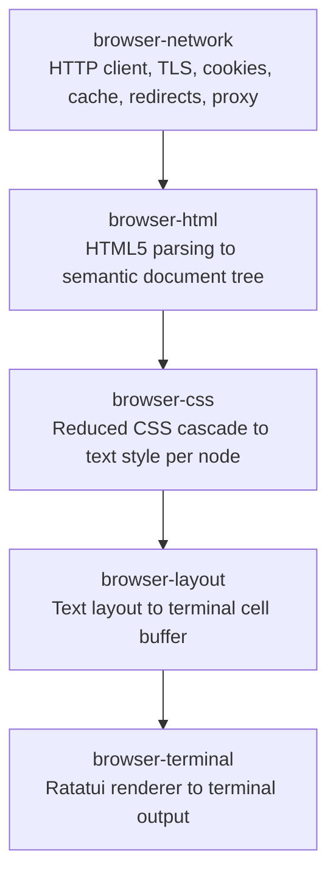
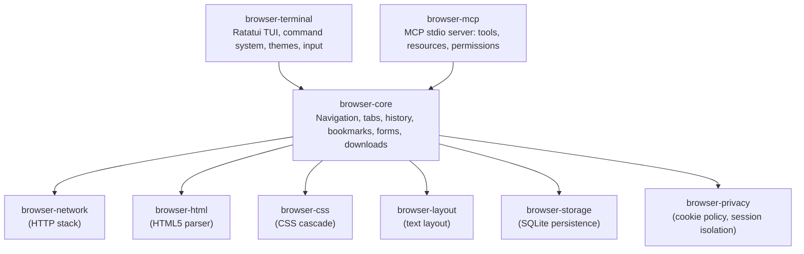

# Architecture

Puma's design separates concerns into independent crates. The rendering pipeline and
the MCP interface share the same browser core. There is no separate "headless" mode.

## Rendering pipeline



## Shared browser core



MCP and the terminal UI operate on the same browser core. There is no simulation of
keyboard input. MCP uses the browser API directly.

## Crate responsibilities

| Crate | Responsibility |
| ----- | -------------- |
| `browser-core` | Navigation controller, tab state, browsing history, bookmarks, forms, downloads |
| `browser-network` | HTTP/HTTPS client, TLS (rustls), redirects, proxy, cookie jar, HTTP cache, request filtering. See [network.md](network.md) for transport, resource limits, and outbound request identity. |
| `browser-html` | HTML5 parser (html5ever), semantic document tree builder |
| `browser-css` | Reduced CSS cascade: visibility, display, text decoration, color, generated content |
| `browser-layout` | Text layout engine: word wrap, Unicode grapheme clusters, tables, terminal cell renderer |
| `browser-storage` | SQLite persistence: configuration, profiles, history, bookmarks, themes, site policies |
| `browser-privacy` | Cookie policy enforcement, privacy dashboard state, session isolation |
| `browser-terminal` | Ratatui-based TUI: command system, tab bar, theme engine, input handling, status line |
| `browser-mcp` | MCP server (stdio transport): tool implementations, resource definitions, permission model |
| `browser-cli` | Binary entry point: argument parsing, startup, signal handling |

## Key design decisions

**No JavaScript.** The browser has no JS parser, runtime, or DOM scripting. `<script>`
elements are detected and reported; they are never executed. This is a non-negotiable
constraint.

**Semantic document tree.** The HTML parser does not feed the terminal renderer directly.
It builds an internal semantic tree (headings, paragraphs, links, forms, tables, etc.)
that both the terminal renderer and the MCP server consume. This ensures a stable,
testable contract between parsing and rendering.

**Text computed style.** Instead of a full CSS graphical computed style, the CSS layer
produces a reduced text style per node: visibility, display mode, emphasis, foreground
color, underline, list markers, white-space, reading order. Pixel geometry and graphical
layout are ignored.

**Terminal escape safety.** Remote content never reaches the terminal as raw bytes.
All content passes through the layout engine, which writes to an off-screen cell buffer.
The renderer writes ANSI sequences from that buffer, not from the source document.

**Privacy by default.** The browser rejects all cookies unless the user enables them.
No localStorage, sessionStorage, IndexedDB, or Service Worker storage is implemented.

## Dependency order

Build and test crates in dependency order (inner to outer):

```
browser-network
browser-html
browser-css
browser-layout
browser-storage
browser-privacy
browser-core        (depends on all above)
browser-terminal    (depends on browser-core)
browser-mcp         (depends on browser-core)
browser-cli         (depends on browser-terminal, browser-mcp)
```
