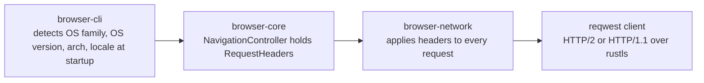

# Network Layer

`browser-network` acquires bytes for one URL at a time and hands them to `browser-html`.
It has no cookie interpretation, no HTML awareness, and no proxy support. It builds on
`reqwest` with `rustls`, so there is no OpenSSL dependency anywhere in the binary.

## Transport

Puma speaks HTTP/1.1 and HTTP/2. `reqwest` negotiates the protocol automatically over TLS
ALPN when the server offers HTTP/2; Puma sends no cleartext HTTP/2 and configures no
explicit protocol preference.

Response bodies are decoded transparently for three content encodings: gzip, brotli, and
zstd. `browser-network` never sees the compressed bytes; `reqwest` decodes the stream
before `browser-network`'s size limits apply.

## Resource limits

| Limit | Value | Enforced |
| ----- | ----- | -------- |
| Response body | 10 MiB | Checked against `Content-Length` up front, then against a running total while the body streams in, so an oversized body is abandoned before it is fully collected. |
| Response headers | 32 KiB | Approximated as the sum of each header's name and value length, checked immediately after the response arrives and before `Set-Cookie` or `Location` is read. Enforced on every redirect hop, not only the final response. |
| Redirects | 10 | Counted by the redirect loop in `fetch_with_progress`; the count resets per navigation. |

A response that exceeds either cap fails with a typed `NetworkError` and is discarded; no
partial body or oversized header set ever reaches `browser-core`.

## Redirect safety

Every redirect target is resolved relative to the current URL before it is followed. Two
checks run on the resolved target:

- The scheme must be `http` or `https`. A redirect to `file://` or any other scheme fails
  the hop.
- An HTTPS origin may not redirect to HTTP. This blocks a downgrade attack where a
  compromised or misconfigured hop drops encryption mid-navigation.

The `Cookie` header sent on the next hop is decided by the caller, `browser-core`, not by
`browser-network`: `fetch_once` accepts an optional cookie header per hop and returns every
`Set-Cookie` line from that hop untouched, for the caller to interpret against its own
cookie policy.

## Outbound request identity

Every outbound HTTP request carries the same five headers, built once and applied to the
request builder:

| Header | Value |
| ------ | ----- |
| `User-Agent` | `Puma/<version> (<OS family> <OS version>; <arch>; +https://github.com/meerita/puma-browser)`. The OS segment is omitted entirely when OS detection is unavailable. |
| `Accept` | `text/html,application/xhtml+xml,application/xml;q=0.9,*/*;q=0.8` |
| `Accept-Language` | Derived from the detected system locale, falling back to `en-US` when no locale is available. |
| `DNT` | `1` |
| `Sec-GPC` | `1` |

A fully detected `User-Agent` on macOS/arm64 reads
`Puma/0.30.0 (macOS 15.5; arm64; +https://github.com/meerita/puma-browser)`. Without OS or
locale detection it reads `Puma/0.30.0 (arm64; +https://github.com/meerita/puma-browser)`.

OS family, OS version, CPU architecture, and locale are detected once at startup in
`browser-cli`; `browser-network` and `browser-core` never perform detection themselves,
they only carry and apply the resulting value. The MCP server constructs
`RequestHeaders::default()`, which reports only the app version and architecture, since it
has no terminal startup path to detect OS or locale from.

None of these headers ever carry a cookie value, a password, or a token. They are built
entirely from the workspace version string and platform detection.

## Error handling

Raw `reqwest` and `rustls` errors never cross the crate boundary. `browser-network` maps
every failure to a typed `NetworkError` variant (`DnsFailure`, `TlsError`, `Timeout`,
`TooManyRedirects`, `ResponseTooLarge`, `ResponseHeadersTooLarge`, and others).
`browser-core` folds these into its own error type, and `browser-terminal` renders them as
short, factual status messages such as `Connection failed`, never as raw driver text.

## What is not implemented yet

Proxy support (HTTP, HTTPS, and SOCKS) is the only item remaining in the networking
milestone. No proxy configuration, environment variable, or `/settings` entry exists yet.
