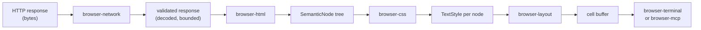
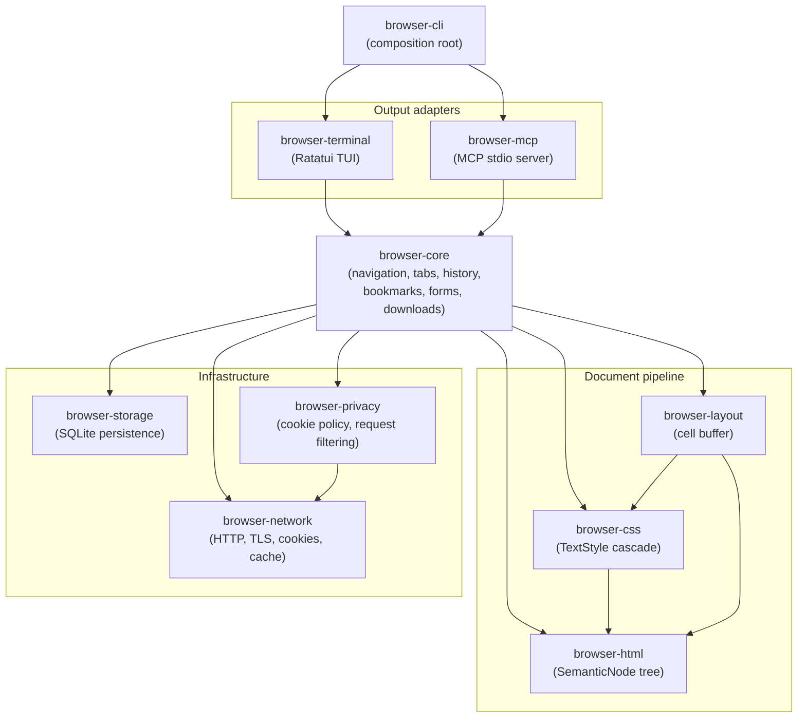
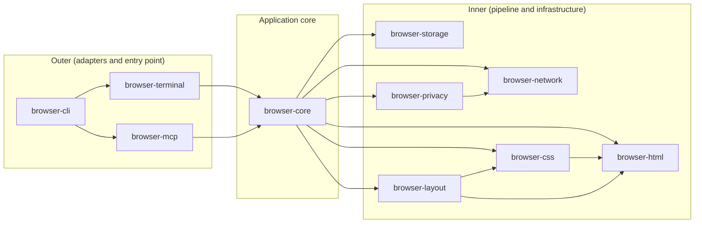
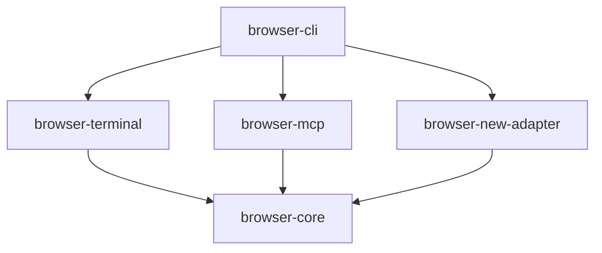

# Architecture Overview

Puma uses two structural patterns. They meet at `browser-core`.

- **Pipeline** for document processing: bytes come in, a rendered cell buffer comes out.
- **Ports and adapters** for output delivery: two independent adapters share the same core.

Neither pattern is novel. They are well-understood and they fit what a browser actually does.

---

## The pipeline

The browser's core job is transforming an HTTP response into readable text. Each crate
in the pipeline consumes the previous stage's output type and produces the next. No
stage knows what comes before or after it beyond its declared input and output types.

`browser-html` does not know that `browser-layout` will consume the `SemanticNode`
tree. `browser-layout` does not know whether the cell buffer will go to a terminal
emulator or an MCP client. Each stage is testable with nothing but its own input type.

### Stage responsibilities

| Stage | Input | Output | Crate |
| ----- | ----- | ------ | ----- |
| Fetch and validate | URL + config | Validated HTTP response | `browser-network` |
| Parse | HTML bytes | `SemanticNode` tree | `browser-html` |
| Style | `SemanticNode` tree | `TextStyle` per node | `browser-css` |
| Layout | Styled nodes + terminal width | Cell buffer | `browser-layout` |
| Render | Cell buffer | Terminal output or MCP JSON | `browser-terminal` / `browser-mcp` |

---

## Ports and adapters

`browser-core` is the application core. It orchestrates the pipeline, manages tabs,
navigation history, bookmarks, forms, and downloads. It knows nothing about terminals
or MCP wire formats.

`browser-terminal` and `browser-mcp` are output adapters. Each reads from `browser-core`
and translates its state into its own output format. They are siblings: neither knows
the other exists.

`browser-cli` is the composition root. It constructs all concrete types, wires the
adapters to the core, and starts the event loop. It contains no business logic.

---

## Crate dependency rules

Dependencies point inward. An inner crate never imports from an outer crate.

The full list of allowed and forbidden imports is in `.claude/rules/09-crate-boundaries.md`.

---

## Shared types

There is no shared `browser-types` or `browser-domain` crate. Each crate owns the
types it defines.

| Type | Defined in | Used by |
| ---- | ---------- | ------- |
| `SemanticNode`, `Document`, `NodeId` | `browser-html` | `browser-css`, `browser-layout`, `browser-terminal`, `browser-mcp` |
| `TextStyle` | `browser-css` | `browser-layout` |
| `TabId`, `TabState`, `CookiePolicy` | `browser-core` | `browser-terminal`, `browser-mcp` |
| `BrowserUrl` | `browser-network` | `browser-core` and all outer crates |

Types flow outward through the crate boundary. An inner crate does not import a type
from an outer crate to represent something the inner crate already knows about.

---

## Adding a new output format

To add a third output adapter (for example, a JSON API for tooling or a headless
testing interface), create a new crate that depends on `browser-core`. The pipeline
and the core do not change.

The adapter reads from `browser-core` state. It does not talk to `browser-terminal`
or `browser-mcp`.

---

## What this architecture does not use

**Clean Architecture (use-case classes, repository interfaces, entity layers).**
That pattern organizes code around a domain model with explicit use-case objects. A
browser is a transformation pipeline, not a business domain. A `NavigateToUrlUseCase`
class would duplicate what `browser-core` already does, with no corresponding benefit
in testability or flexibility.

**Dependency injection containers or service locators.** All wiring happens in
`browser-cli` at startup. Each crate receives what it needs through function arguments
or struct fields.

**Event buses or shared mutable channels between pipeline stages.** The pipeline is
one-way. Cross-cutting concerns that touch multiple stages are handled either by
threading the relevant data to the stage that needs it, or by exposing an inspection
interface on `browser-core`.

---

## Security note

The pipeline enforces a hard boundary between remote content and the terminal. Remote
bytes enter at `browser-network` and travel through the pipeline as typed data
structures (`SemanticNode`, `TextStyle`, cell buffer). They never reach the terminal
as raw bytes. The layout engine writes ANSI sequences from the cell buffer; the
document source never writes escape sequences directly.

The same boundary applies to MCP: `browser-mcp` reads from `browser-core` state and
serializes it to MCP wire format. Web page content is always tagged `trusted: false`.
Web pages cannot invoke MCP tools.

See `.claude/rules/07-security.md` for the full invariants.
